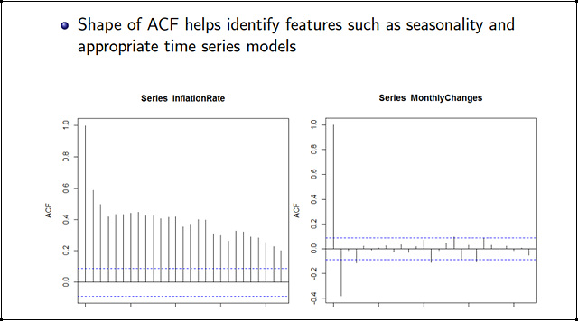
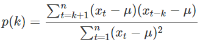
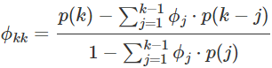
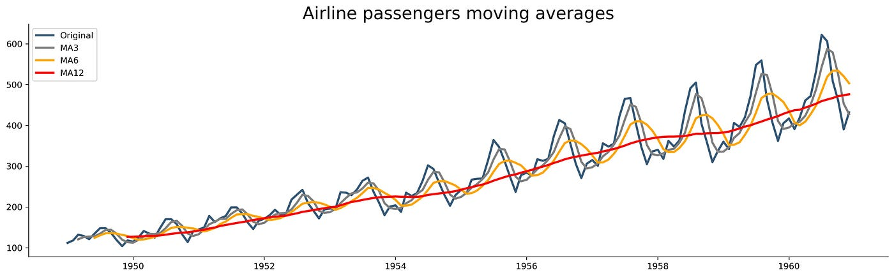
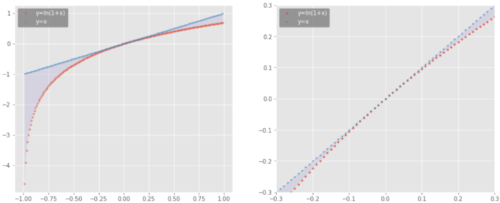

### 시계열 데이터 (Time Series)
- 시간의 흐름에 따라 기록된 정보들을 의미하며, 관측시간에 대한 관측자료의 관계로 표현한다.
- 시간 흐름에 따라 변화하는 방향성을 이해하고, 그 변화를 예측하는 것이 주 목적이다.
- 시계열 데이터의 유형에는 우연 변동 시계열, 계절 변동 시계열, 추세 변동 시계열, 계절-추세 변동 시계열 데이터가 있다.
- 자료의 인덱스가 시간인 데이터다.

 

#### 우연 변동 시계열
- 특정한 패턴이나 추세 없이 우연한 요소에 의해 변하는 데이터다.
- 패턴이나 규칙이 없고 우연히 발생하는 것처럼 보인다.

 

#### 계절 변동 시계열
- 특정한 시간 주기(예시: 1달, 1년 등)에 따라 발생하는 패턴이 나타나는 데이터다.
- 특정 시간에 특정 사건이 반복된다.

 

#### 추세 변동 시계열
- 시간에 따라 일정한 방향으로 계속해서 증가하거나 감소하는 추세를 보이는 데이터다.
- 일정한 방향으로 계속해서 증가하거나 감소한다.

 

#### 계절-추세 변동 시계열
- 추세와 계절성 요인이 함께 나타나는 데이터로,  
  시간에 따른 일정한 추세와 특정 시간 주기에 따른 패턴이 동시에 나타나는 데이터다.
- 시간의 흐름에 따라 일정한 방향으로 움직이면서도 특정 시간에 특정한 일이 반복된다.

 

---

 

### 정상성 (Stationarity)
- 일정해서 늘 한결같은 성질을 의미한다.
- 관측된 시간에 상관 없이 과거, 현재, 미래의 분포가 같아야 한다.
- 평균, 분산 등이 변하지 않으며 추세나 계절성이 없는 시계열 데이터다.
- 하지만, 정상성을 나타내는 시계열은 장기적으로 볼 때  
  예측할 수 있는 패턴을 나타내지 않아야 한다. 즉, 불규칙해야 한다.
- 즉, 어떤 특정 주기로 반복되는 계절성이나 증가 또는 감소하는 추세성이 없어야 한다.

 

### 라그 (Lag)
- 라그(시차)는 현재 시점에서 이전 시점의 값을 의미하며, 특정 시점 t에서의 라그는 t-k의 값을 가리킨다.
- 시계열 데이터에서 패턴과 트렌드를 분석하고 예측하는 데 있어 중요한 개념이다.
- 예를 들어, 하루 전 주가를 이용하여 다음 날 주가를 예측하는 것과 같은 분석에 사용될 수 있다.

 

### 차분 (Differencing)
- 연이은 관측값들의 차이를 계산한다.
- 시계열 데이터의 평균과 분산이 일정해야 다음 시계열 값을 예측할 수 있다.
- 정상성을 나타내지 않는 시계열에서 정상성이 나타나도록 만드는 대표적인 방법이다.
- 차분을 통해 추세나 계절성을 제거하거나 감소시킬 수 있다.
- 라그를 사용하여 시계열 데이터를 분석할 때, 라그된 데이터 사이의 차이를 계산하여 차분을 수행한다.

 

### 자기상관 함수 (ACF, Autocorrelation Function)
- 자기상관이란, 현재 시점에서 이전 시점 간의 관련성을 의미한다.
- 시간의 흐름에 따른 각 데이터는 독립적이지 않다.
- 어제의 데이터가 오늘의 데이터에, 오늘의 데이터가 내일의 데이터에 영향을 준다는 것을 의미한다.
- 시계열의 라그 사이의 선형 관계를 측정해서 시계열 자료의 정상성을 파악할 때 사용한다.
- ACF 그래프는 정상 시계열일 경우 모든 시차에서 0에 근접한 모양을 나타내고,  
  비정상 시계열은 천천히 감소할 경우 추세 변동, 물결 모양일 경우 계절 변동 시계열이다.

 

### 부분자기상관 함수 (PACF, Partial Autocorrelation Function)
- 다른 시차의 영향을 제거한 후에 나타나는 자기상관을 보여준다.
- 해당 시점과 주어진 시차 사이의 관계를 확인할 때, 사이에 있는 시차들의 영향을 배제한다.
- 현재 시점을 기준으로 라그를 설정하면, 이전 시점과의 차이를 계속 구해나가는 것이 아니라  
  2 라그 전, 3 라그 전 등 부분적으로 영향을 주는 시차를 확인할 수 있다.
- 이 때, 다른 시차의 영향을 제거하고 해당 시차와의 상관관계만 측정한다.
- PACF를 통해 데이터의 직접적인 상관관계를 파악하는 것은 유용하지만,  
  정상 시계열과 비정상 시계열을 구분하기 어렵다.

 

### ACF와 PACF
1. ACF

> 
>
> - 시차에 대한 합들이 누적된다.
> - 현재 시점으로부터 바로 전 라그와의 상관관계를 측정한다.
> - 시계열 데이터의 전반적인 패턴을 파악해서 추세나 주기성 등 다양한 특성을 확인할 수 있다.
> - 차분을 통해 정상 시계열로 변환한 뒤 ACF를 구하면, 정상성을 가진 시계열에서의 자기상관을 파악할 수 있다.
> - 온라인 판매 플랫폼에서 전날 방문자 수와 현재 방문자 수 간의 자기상관관계를 확인함으로써,  
마케팅 활동이나 프로모션 등의 변화가 방문자 수에 미치는 영향을 이해할 수 있게 된다.

 

2. PACF

> 
>
> - 특정 시차의 영향을 반복적으로 제거한다.
> - 이전 라그와의 상관관계뿐만 아니라 훨씬 이전의 시차와의 상관관계도 측정할 수 있다.
> - 직접적인 상관관계를 파악하는 데 유용하고, 특정 시차에 대한 자기상관을 직접적으로 보여준다.
> - 이를 통해 특정 시점이 다른 시점에 미치는 영향력을 파악하는 데 용이하다.
> - 이미 정상성을 가진 데이터라면, 차분 없이 PACF를 사용해서 직접적인 상관관계를 파악하는 것이 더 효율적일 수 있다.
> - 주식 시장에서 주가 예측 모델을 구축하는 경우,  
특정 시점의 주가와 한 달 전의 주가 간의 직접적인 상관관계를 확인함으로써  
한 달 전의 주가 변동이 현재 주가에 미치는 영향을 파악할 수 있게 된다.

 

---

 

### 자기회귀 (AR, Autoregressive Model)
- 현시점의 자료는 p시점 전의 유한개의 과거 자료로 설명될 수 있다.
- 과거의 데이터가 미래 데이터에 영향을 준다고 가정하는 모델이다.
- 현시점의 시계열 자료에서 몇 번째 전 자료까지 영향을 주는가를 파악하는 데 사용된다.
- 현시점의 데이터가 직전 시점의 데이터에만 영향을 받는 모델을 1차 자기회귀 모형이라 하고, AR(1)로 표기한다.
- 이를 알아내기 위해서는 데이터의 패턴을 분석해야 하고, 이 때 ACF와 PACF를 사용한다.
- 표준정규분포 영역 내에 들어가는 첫 번째 지점을 절단점이라고 하며,  
  절단점에서 1을 뺀 값이 AR모델의 차수다.

> 1. ACF  
> 만약 자기회귀 모델이라면,  
> 현재 데이터와 멀리 떨어진 시점의 과거 데이터의 영향력은  
점점 줄어들기 때문에 시간이 지남에 따라 상관관계가 줄어든다.

 

> 2. PACF  
> 만약 자기회귀 모델이라면,  
> 특정 시점 이후에 급격하게 감소하는 모양이 나타난다.

- 즉, 자기회귀 모델이라면, ACF는 시차가 증가함에 따라 점차 감소하고  
  PACF는 특정 시점 이후 급격히 감소하여 절단된 모양이 나타난다.
- 자기회귀 모델을 식별함으로써 데이터의 기본 구조와 패턴을 이해할 수 있고,  
  이를 통해 데이터가 어떻게 변동하는지, 과거의 데이터가 미래의 데이터에 어떤 영향을 미치는 지에 대한 통찰력을 제공한다.

 

### 이동평균 (MA, Moving Average)
- 일정 기간 동안의 데이터를 평균하여 시계열 데이터의 부드러운 패턴을 확인할 수 있게 해준다.
- 특정 기간 동안의 데이터를 평균한 값으로, 시계열 데이터의 일정 기간 동안의 평균을 보여준다.
- 데이터의 변동을 부드럽게 만들어서 패턴을 파악하는 데 도움이 되며,  
  시계열 데이터의 추세를 이해하고 예측하는 데 유용한 도구이다.

 

### 안정 시계열 (ARMA)
- 과거의 데이터와 최근의 평균을 사용하여 시계열 데이터의 패턴을 파악하고 예측하는 데에 사용한다.
- 2022년 3월 기준으로 ARMA가 중단되고 ARIMA로 대체되었다.
- ARMA 모델은 시계열 데이터의 과거 값을 기반으로 한 선형 예측 모델이기 때문에  
  시계열 데이터가 정상성을 보이고, 예측에 영향을 주는 외부 요인이 없는 등의 가정을 만족해야 한다.
- 비정상성 데이터나 비선형적인 패턴을 갖는 데이터의 경우, 패턴 파악 및 예측이 어렵다.
- ARMA(1, 0) = AR(1)
- ARMA(0, 1) = MA(1)
- ARMA(1, 1) = AR(1), MA(1)

 

### 불안정 시계열 (ARIMA)
- ARIMA(p, d, q): d차로 차분한 데이터에 AR(p) 모형과 MA(q) 모형을 합친 모델이다.
- Autoregressive, Integrated(누적 차분), Moving Averate의 세 가지 요소로 구성되어 있다.
- I는 비정상 시계열을 정상 시계열로 만들기 위해 필요한 차분 횟수를 의미한다.

 

---

 

### 금융 시장의 수익률 (Financial Market Return)
- 일반적으로 금융 시장을 분석하거나 머신러닝 모델을 구축할 때  
  price(수익금)가 아닌 return(수익률)을 활용하는 경우가 많다.
- 수익률을 통해 복리 계산과 연율화(1년 간의 성장률) 등을 위해 무수히 많은 반복 계산을 하게 되므로  
  (1 + return)으로 계산할 경우, 복잡하고 번거로워진다.
- 기존 return에 log를 취해주면, 더 편한 계산이 가능해지지만 당연히 약간의 오차가 발생하게 된다.
- 하지만 약간의 오차를 감수하고 log를 사용함으로써 얻는 이득이 훨씬 많고,  
  국내 주식에서는 상한선과 하한선이 -30% ~ 30% 제약까지 있기 때문에 일반적인 주가 변동에 대해 오차가 극히 적다.
- 즉, log를 취하는 것은 정밀성보다 편의성을 높인 것으로 이해하면 된다.
- 수익률 단위가 분, 초, 밀리초 단위 이하로 내려가야 정밀성에 차이가 많이 발생하지만,  
  실제 금융 시장에서는 최소 하루 단위 이상으로 계산하기 때문에 오차가 거의 발생하지 않게 된다.
- 또한 return에 log를 취하면 우측으로 치우친 확률 분포를 중심으로  
  재조정해주는 효과까지 있기 때문에 안 쓸 이유가 없다.

