## 🩶 시계열 데이터 프로젝트 - 은 ETF 가격 예측

- 은 ETF 중 시장 규모가 가장 큰 BlackRock 주식회사의 iShares Silver Trust(SLV)의 향후 1년 간의 주가 예측

- SLV의 주가 단위는 달러($)이며, 은 1온스(약 28g)의 가격을 기준으로 함
- 비슷한 성격을 가진 종목인 금 ETF(GLD)와의 연관성도 분석

---

### 📑 데이터 분석

야후 증권 데이터인 yfinance에서 금과 은 ETF(GLD, SLV) 주가 데이터만 받아옵니다. 

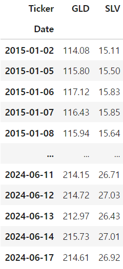

이후 각 종목의 시간에 따른 주가 변화 및 변화량, 변화율을 시각화했습니다.

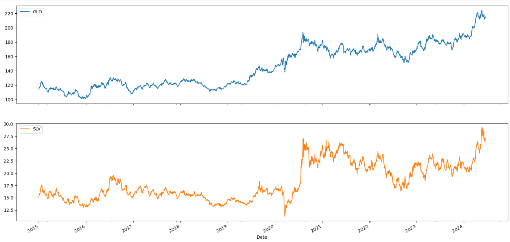

#### 분석
- 전반적으로 은 ETF의 가격 변화율이 금에 비해 더 심하게 나타났으며, 특히 2020년대에 큰 변동이 있었습니다.  
  이는 COVID-19 팬데믹의 영향으로, 그래프에 나타났듯이 초기에는 불확실성과 공포로 인해 은 시세가 급락했지만,  
  이후 안전자산에 대한 수요 증가 및 중앙 은행의 대규모 통화 완화 정책 등으로 다시 시세가 급증했습니다.
  
- 그 외 시간대에서 금과 은 ETF의 주가는 대부분의 시간대에서 비슷한 양상을 보이는 것을 알 수 있었습니다.
- 변화량 그래프의 형태로 보아, 금과 은 ETF 모두 분산이 일정하지 않습니다. 

---

### 💰 수익률 산출
- 현재 시점에 대한 다음 시점의 수익률 산출
- 로그를 취함으로서 계산을 용이하게 하며, 전반적인 데이터 분포를 대칭형으로 맞춰줌

shift()를 사용하여 원본 데이터프레임을 한 행 아래로 내려준 뒤,  
기존 데이터프레임의 같은 셀과 나눠주었고, 이 다음 로그를 취하여  
현재 시점에 대한 다음 시점의 수익률을 구했습니다.

이후 각 시점 별 수익률을 시각화했습니다.

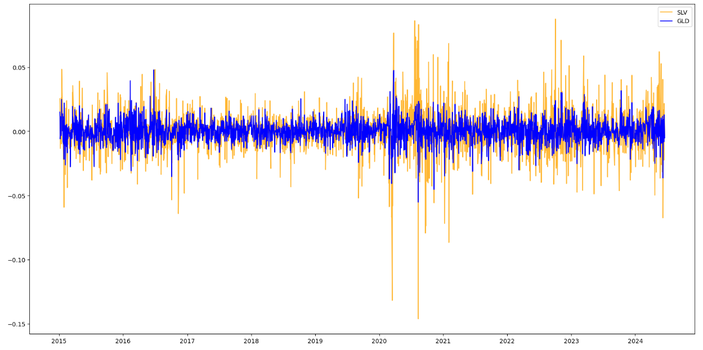

그 다음에는 연율화(연간 수익률)를 산출했습니다.
그 결과는 아래와 같습니다.

그 다음, 금과 은 ETF의 수익률 분포를 시각화샜습니다.
수익률 산출 과정에서 로그를 취했기 때문에 분포가 대칭을 띄는 것을 볼 수 있었습니다.

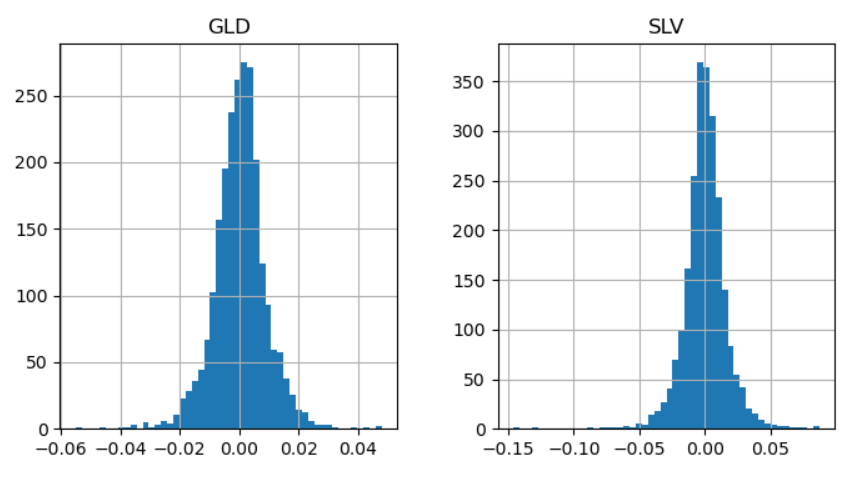

마지막으로 일간 수익률과 월간 수익률을 구했습니다.
이 때는 로그를 취한 값에 다시 지수를 취함으로써 단순 수익률로 변환해주었습니다.

월간 수익률의 경우, 매 달의 마지막 시점에서 resample 해주었기 때문에
그래프가 일간 수익률에 비해 smoothing 된 것을 볼 수 있습니다.

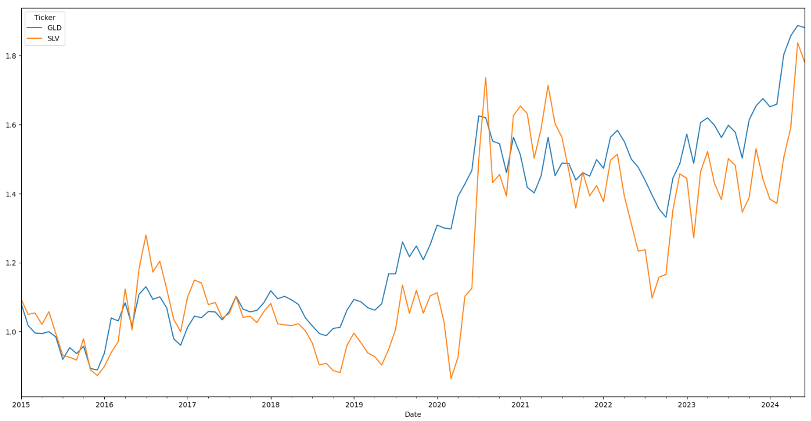

#### 분석
- 금이 은보다 연간 수익률이 근소하게 높았습니다.
- 은 ETF의 수익률은 금에 비해 심하게 변화했습니다.  
  이는 위의 주가 그래프에서도 알 수 있었습니다.
- 수익률 산출 과정에서 로그를 취했기 때문에, 수익률 분포가 0을 기준으로 대칭에 가까운 형태를 보이는 것입니다.

---

### 💰 금, 은 ETF 가격의 상관관계 분석

금과 은 ETF 주가 간 상관관계를 분석했습니다.
이 때는 VIF(분산 팽창 요인) Score를 사용했습니다.

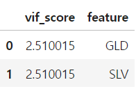

두 종목 모두 VIF Score가 높지 않은 것으로 보아,  
금과 은 ETF간 상관관계는 그다지 크지 않다고 볼 수 있습니다. 

---

### 📑 종합 분석
- 금이 은에 비해 수익률이 더 높게 나타났으며, 수익률 변화도 더욱 안정적입니다.
- 다만, 금과 은의 가격은 현재 점차 상승하고 있으며, 은 ETF의 주당 가격이 금에 비해 훨씬 낮기 때문에  
  적은 자본으로도 투자하기 좋을 것으로 보입니다.

---

### 🩶 은 ETF 주가 분석
- 여러 지표를 시각화하며 은 ETF 주가 분석

머신 러닝 모델로 학습하기 이전에 은 ETF 주가에 대한 분석을 진행했습니다.

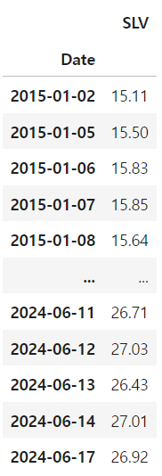

우선 각 시점 별로 향후 20 영업일까지의 주가 최저가, 중간값, 최고가를 새로운 컬럼으로 추가했습니다.

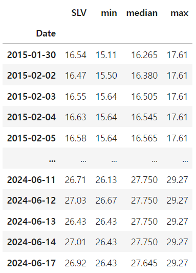

이후 최근 2년간의 은 ETF의 주가와 함께 위에서 추가한 컬럼들의 그래프를 시각화해주었습니다.

#### 매수 / 매도 타이밍 시각화
- 최근 1개월, 1년 간의 주가 평균으로 매수 / 매도 타이밍 분석

최근 1개월 간, 최근 1년 간 영업일의 주가 평균을 새로운 컬럼으로 추가했습니다.  
1개월은 20 영업일, 1년은 252 영업일을 기준으로 했습니다.

그리고 일간 주가와 월 평균 주가, 연 평균 주가를 시각화해주었습니다.
마찬가지로 최근 2년간의 그래프만 시각화해주었습니다.

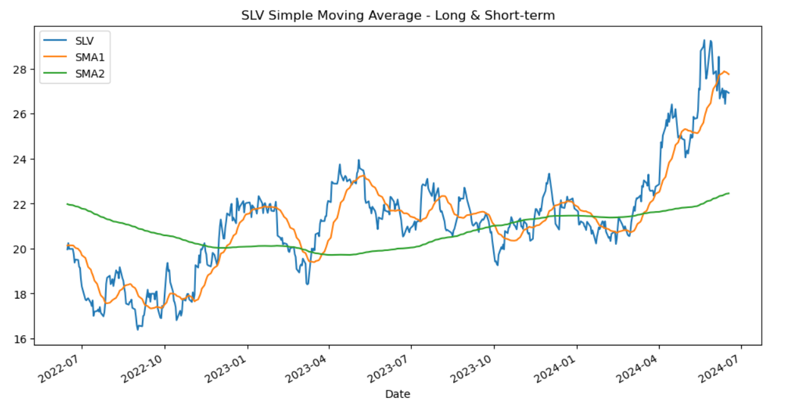

더 오랜 기간의 평균을 산출할수록 그래프가 smoothing 되는 것을 볼 수 있었습니다.

이후, 일 평균과 연 평균 주가를 비교하여 1 또는 -1의 값을 가지는 새로운 컬럼을 추가하고, 위 그래프와 같이 시각화했습니다.

월 평균 주가와 연 평균 주가 그래프가 겹쳐지는 지점들 중  
월 평균이 높아지는 지점은 **골든 크로스**, 연 평균이 높아지는 지점은 **데드 크로스**라고 합니다.

골든 크로스 시점 이후에는 매수, 데드 크로스 시점 이후에는 매도하는 것이 권장됩니다.

---

### 🩶 ARIMA 모델로 은 가격 예측
- 최적의 차분 수를 구하고 auto_arima를 사용하여 하이퍼 파라미터까지 최적화한 다음,  
  해당 모델로 올해 초부터의 은 ETF 주가를 예측하여 실제 주가와 비교

먼저, 최근 2년 간의 은 ETF 주가 데이터만 가져온 다음,  
앞쪽 시기 80%를 train, 뒤쪽 시기 20%를 test 데이터로 분할해주었습니다.

아래 그래프는 train과 test를 시각화 한 결과로,  
두 그래프가 별 다른 문제없이 이어지는 것을 볼 수 있습니다.

#### 🔢 최적의 차분 수 구하기
- 현재 데이터에는 추세가 있기 때문에 정상성이 없음
- 시계열 데이터를 분석하기 위해서는 정상성을 만들어야 하며, 이를 위해 차분을 수행
- 서로 다른 3가지 알고리즘으로 최적의 차분 수를 산출하고, 아래의 auto_arima()에 할당

서로 다른 3가지 알고리즘으로 은 ETF 주가 데이터에 최적 차분 수를 구하고,  
그 중 최대값을 구해주었습니다.

그 결과, 최적의 차분 수는 1이라는 결과가 나왔습니다.

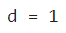

#### 📈 1차 차분 후의 ACF랑 PACF 그래프 시각화
- 최적 차분 했을 때 정상성이 생기는 지 확인

위에서 구한대로, 1차 차분했을 때 정상성이 생기는지를 ACF와 PACF 그래프를 통해 확인했습니다.

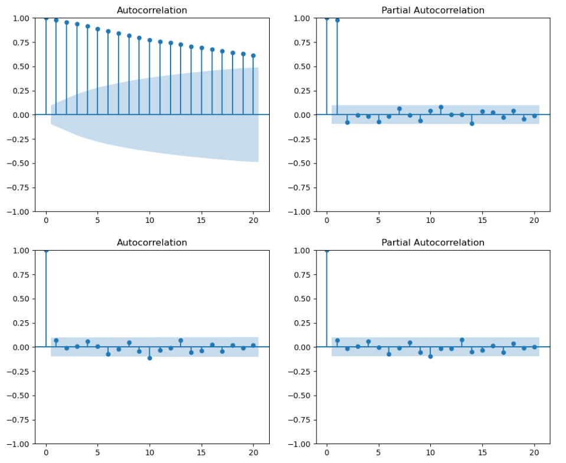

#### 분석
- 위 3가지 알고리즘으로 구한 최적의 차분 수(1)로 차분한 결과 정상성이 생겼습니다.
- 또한 차분 이전 원본의 ACF와 PACF 그래프의 형태로 보아 이 데이터는 1차 자기회귀 모형이며,  
  이는 현재의 데이터는 직전 시점의 데이터에 영향을 가장 많이 받는다는 것을 의미합니다.

auto_arima()로 하이퍼 파라미터 최적화 및 모델 튜닝을 진행했습니다.
d에는 위 과정으로 구한 최적 차분 수인 1을, p와 q는 0 ~ 10차 사이에서 최적의 계수를 찾도록 했습니다.

여기서 p는 AR(자기회귀) 모델의 차수를, q는 MA(이동 평균)의 차수를 의미합니다.

그 결과, 위 결과에 나온 최적의 파라미터로 모델이 튜닝되었으며,  
이 모델에 fit을 진행해 주었습니다.

그 후, <code>model.summary</code>를 통해 모델의 성능 지표를 출력했고,
<code>model.plot_diagnostics</code>로 차분 이후의 변화량과 데이터 분포 및 ACF를 시각화해보았습니다.

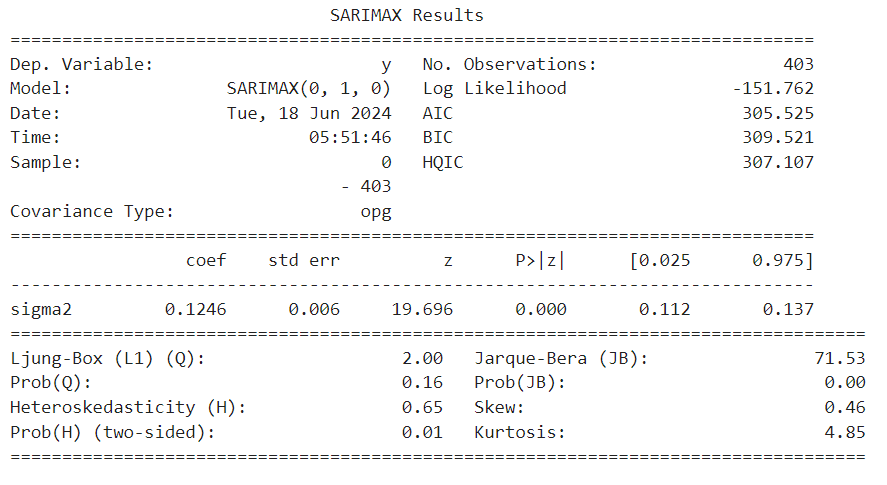

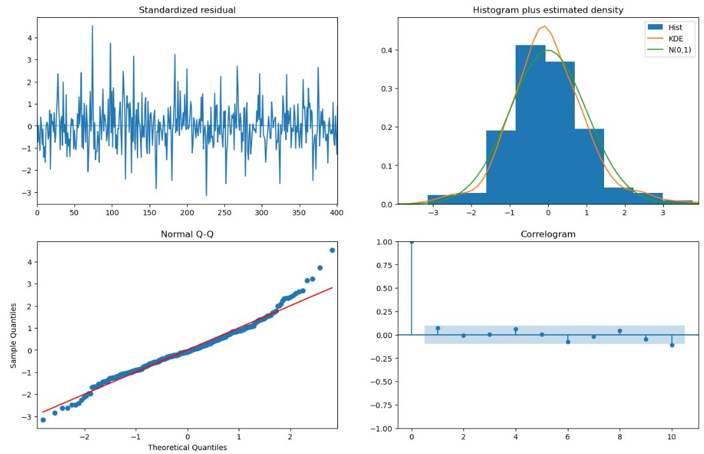

#### 모델 분석
- Prob(Q): 0.05 이상으로 측정되었기 때문에 이 데이터는 서로 독립적이며 동일한 분포를 따른다고 할 수 있습니다.
- Prob(H): 0.05 미만으로 측정되었기 때문에
  이 데이터는 잔차(실제-예측값 차이)의 분산이 일정하지 않다고 할 수 있습니다.
- Prob(JB): 0.05 미만으로 측정되었기 때문에 평균과 분산이 일정하지 않다고 할 수 있습니다.
- Skew: 수치 상으로 볼 때, 이 데이터는 분포가 양의 방향에 약간 쏠려있다고 할 수 있습니다.
- Kurtosis: 약 4.8 정도로 측정되었기 때문에, 정규분포(Kurtosis=3)보다 첨도가 높다고 할 수 있습니다.

---

#### 🔎 ARIMA 모델로 test 데이터 예측
- 한 시점의 결과를 예측할 때마다, 예측값을 토대로 모델 업데이트
- 이는 예측 결과가 등차수열 혹은 일정한 값으로만 예측되는 현상을 방지하기 위함

한 시점의 데이터를 예측할 때마다의 결과를 반환하는 함수를 선언한 뒤,

반복문으로 test 데이터를 하나씩 예측할 때마다 해당 함수를 통해 모델을 업데이트 했습니다.

그 후, 하나의 플롯에 train과 test, pred(예측값)을 시각화해주었습니다.

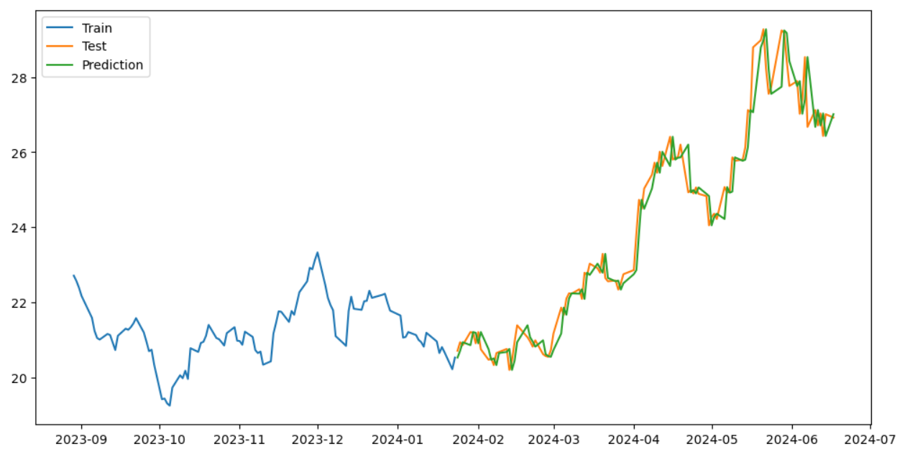

위 그래프 상으로는 약간의 오차를 보이는 것 같지만,  
보다 정확한 오차를 측정하기 위해 MAPE로 예측과 실제 데이터 간 오차(%)를 구했습니다.

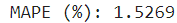

#### 🚩 ARIMA 모델 예측 결과
- ARIMA 모델로 올해 초부터의 은 ETF 가격을 예측한 결과, 실제 주가 그래프와 약 1.5%의 오차를 보였다. 

---

### 🩶 Prophet으로 은 가격 예측
- Prophet 딥러닝 모델로 최근 2년 간의 은 ETF 주가를 학습하여 향후 1년의 주가 예측

#### 📑 데이터 전처리
- Prophet 모델에 사용할 수 있는 형태로 데이터 전처리

우선 은 ETF 주가 데이터가 담긴 데이터프레임을 가져왔습니다.

ARIMA와 마찬가지로, 최근 2년 간의 주가만 가져온 뒤,  
기존의 인덱스였던 날짜를 새로운 컬럼으로 변경해주었습니다.

그리고 날짜 컬럼명을 <code>ds</code>로 변경해주었습니다.
이는 Prophet 모델 학습에서 사용하는 컨벤션의 일종입니다.

---

#### 교차 검증 (Cross Validation)
- 아래의 하이퍼 파라미터를 모든 경우의 수대로 조합한 다음,  
  각 하이퍼 파라미터 조합 중 가장 우수한 성능(가장 적은 오차)을 보였을 때로 튜닝 후 예측
> - changepoint_prior_scale: trend의 변화량을 반영하는 정도 (default=0.05)
> - seasonality_prior_scale: 계절성을 반영하는 정도
> - seasonality_mode: 계절성으로 나타나는 효과를 더해나갈지(additive), 곱해나갈지(multiplicative) 정함

교차 검증을 통해 Prophet 모델의 최적의 하이퍼 파라미터 조합을 탐색해보았습니다.

교차 검증이 완료된 뒤, 오차(MAPE)가 가장 적은 순으로  
상위 5개의 하이퍼 파라미터 조합을 출력해 본 결과는 다음과 같습니다.

위에서 확인한 최적의 하이퍼 파라미터 조합대로,  
changepoint_prior_scale=0.05, seasonality_prior_scale=0.05, seasonality_mode='multiplicative'  
로 Prophet 모델을 튜닝한 뒤 fit을 진행했습니다.

이후 <code>model.make_future_dataframe(periods=365)</code>로 향후 1년간 은 ETF 주가를 예측한 뒤,  
해당 그래프를 시각화 해보았습니다.

하지만 시각화 결과 위와 같이 예측값이 큰 편차를 보이는 현상을 확인했으며,  
이는 seasonality_mode를 <code>multiplicative</code>로 설정하여 발생한 문제라고 생각했습니다.

따라서 교차 검증 결과 중 additive파 포함된 하이퍼 파라미터 조합에서 오차가 가장 적었던  
changepoint_prior_scale=0.05, seasonality_prior_scale=0.05, seasonality_mode='additive'  
로 Prophet 모델을 다시 튜닝한 뒤, fit을 진행하고 향후 1년 간의 주가를 다시 예측했습니다.

그 결과는 다음과 같았습니다.

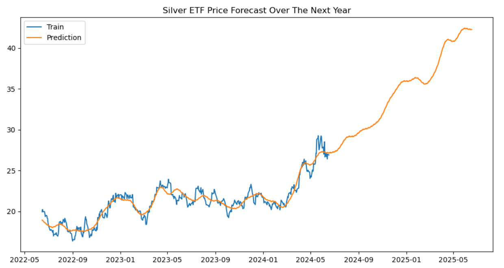

이후 <code>model.plot</code>으로 신뢰 구간과 같이 시각화해보았습니다.

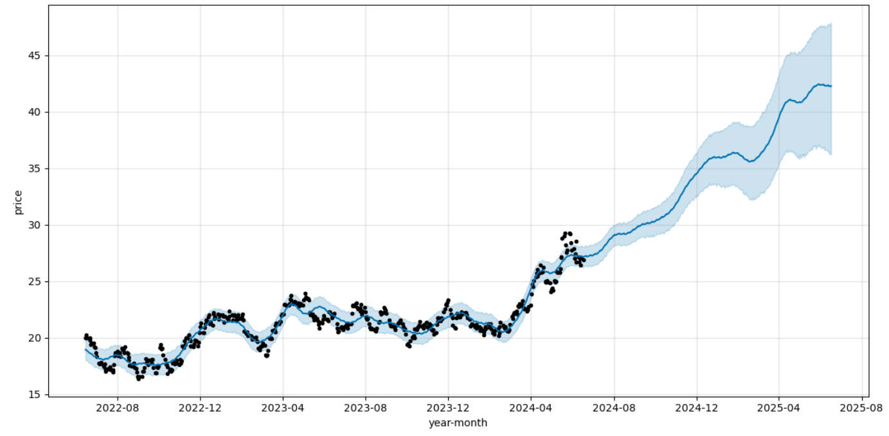

마지막으로 <code>model.plot_components(forecast)</code>로
모델 예측 결과의 시간대 별, 요일 별, 주기 별 변동성을 시각화했습니다.

시간대 별 변동성

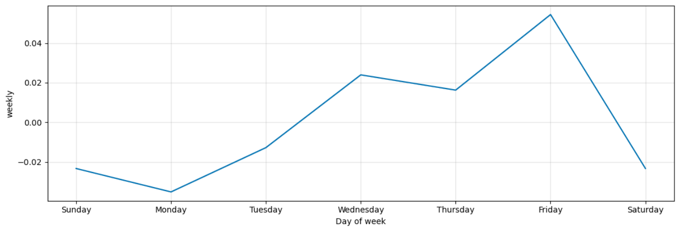
요일 별 변동성

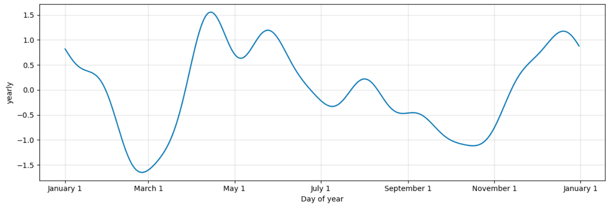
주 별 변동성

---

#### 🚩 Prophet 모델 예측 결과
- Prophet 모델로 향후 1년간의 은 ETF 주가를 예측한 결과,  
  2025년 6월까지 기존의 상승 추세를 이어나갈 것이라고 예측했습니다.
- 요일에 따른 수익률 예측 결과 그래프로 보아,  
  이 모델은 매주 월요일에 수익률 최저치를 기록한 뒤 금요일에 최고치를 달성할 것이라고 예측했습니다.
- 계절에 따른 수익률 예측 결과에서는 3월에 최저치, 4월에는 최고치를 기록할 것이라고 예측했습니다.  
  이는 예측 그래프에서 2025년 3월 경 주가가 한 번 하락하는 현상이 나타난 것으로 보입니다.
  
---

- 종합해 봤을 때, 이 모델은 앞으로의 은 ETF 시세를 긍정적인 전망으로 보고 있다고 할 수 있습니다.

