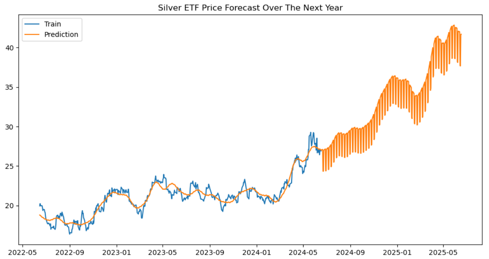
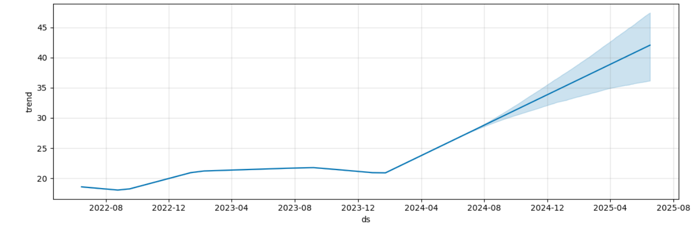

## 🩶 시계열 데이터 프로젝트 - 은 ETF 가격 예측


<sub>츨처: https://stock.adobe.com/search?k=silver+ingot</sub>

---

- 은 ETF 중 시장 규모가 가장 큰 BlackRock 주식회사의 iShares Silver Trust(SLV)의 향후 1년 간의 주가 예측

<br>


<p><sub>츨처: https://blog.millionero.com/news/blackrock-files-for-bitcoin-spot-etf-in-the-us</sub></p>

- SLV의 주가 단위는 달러($, 한화 약 1,380원)이며, 은 1온스(약 28g)의 가격을 기준으로 함
- 금 ETF(GLD) 주가와의 연관성도 분석

<br>

---

### 📑 데이터 분석

<br>

야후 증권 데이터인 yfinance에서 금과 은 ETF(GLD, SLV) 주가 데이터만 받아왔습니다. 

<details>
<summary>코드</summary>

```
import yfinance as yf

# yfinance에서 2015년부터의 금과 은 ETF(GLD, SLV) 주가 데이터만 가져와서 데이터프레임 생성
# 가격 데이터는 종가(Adj Close)를 기준으로 함
columns = ['GLD', 'SLV']

f_df = yf.download(columns, start='2015-01-01')['Adj Close'].round(4)
f_df
```

</details>


<br>

이후, 각 종목의 시간에 따른 주가 변화 및 변화량, 변화율을 시각화했습니다.

##### 주가 변화

<details>
<summary>코드</summary>

```
import matplotlib.pyplot as plt

# 금, 은 ETF의 시간에 따른 주가 시각화
f_df.plot(figsize=(20, 10), subplots=True)
plt.show()
```

</details>


<br>

##### 주가 변화량

<details>
<summary>코드</summary>

```
# 금, 은 ETF의 시간에 따른 주가 변화량 시각화
f_df.diff().plot(figsize=(20, 10), subplots=True)
plt.show()
```

</details>


<br>

##### 주가 변화율

<details>
<summary>코드</summary>

```
# 금과 은 ETF의 주가 변화율 시각화
f_df.pct_change().mean().plot(kind='bar', figsize=(4, 5))
plt.show()
```

</details>


<br>

#### 분석
- 전반적으로 은 ETF의 가격 변화율이 금에 비해 더 심하게 나타났으며, 특히 2020년대에 큰 변동이 있었습니다.  
  이는 COVID-19 팬데믹의 영향으로, 그래프에 나타났듯이 초기에는 불확실성과 공포로 인해 은 시세가 급락했지만,  
  이후 안전자산에 대한 수요 증가 및 중앙 은행의 대규모 통화 완화 정책 등으로 다시 시세가 급증했습니다.


<p><sub>츨처: https://www.nfid.org/infectious-disease/coronaviruses</sub></p>
  
- 그 외 시간대에서 금과 은 ETF의 주가는 대부분의 시간대에서 비슷한 양상을 보이는 것을 알 수 있었습니다.
- 변화량 그래프의 형태로 보아, 금과 은 ETF 모두 분산이 일정하지 않습니다.

---

### 💰 수익률 산출
- 현재 시점에 대한 다음 시점의 수익률 산출
- 로그를 취함으로서 계산을 용이하게 하며, 전반적인 데이터 분포를 대칭형으로 맞춰줌

<br>

shift()를 사용하여 원본 데이터프레임을 한 행 아래로 내려준 뒤,  
기존 데이터프레임의 같은 셀과 나눠주었고, 이 다음 로그를 취하여  
현재 시점에 대한 다음 시점의 수익률을 구했습니다.

<details>
<summary>코드</summary>

```
import numpy as np

# 금과 은 ETF의 수익률 산출
rate_f_df = np.log(f_df / f_df.shift(1))
rate_f_df = rate_f_df.dropna()
rate_f_df
```

</details>


<br>

이후 시점 별 수익률을 시각화했습니다.

<details>
<summary>코드</summary>

```
# 금과 은 ETF의 수익률을 하나의 플롯에 시각화
rate_f_df.plot(figsize=(20, 10), lw=0.7)
plt.show()
```

</details>


<br>

그 다음에는 연율화(연간 수익률)를 산출했습니다.  
그 결과는 아래와 같습니다.

<details>
<summary>코드</summary>

```
# 연율화를 바플롯으로 시각화
(rate_f_df.mean() * 252).plot(kind='bar', figsize=(4, 5))
plt.show()
```

</details>


<br>

그 다음, 로그를 취하기 전후의 금과 은 ETF의 수익률 분포를 시각화했습니다.  
로그를 취하지 않았어도 분포가 대칭을 띄는 것을 볼 수 있었지만,  
로그를 취함으로써 분포를 더 안정적인 형태로 만들어주었습니다.

<details>
<summary>코드</summary>

```
# 로그를 취하지 않았을 때의 금과 은 ETF의 수익률 분포를 히스토그램으로 출력
np.exp(rate_f_df).hist(figsize=(8, 4), bins=50)
plt.show()

# 금과 은 ETF의 수익률 분포를 히스토그램으로 출력
rate_f_df.hist(figsize=(8, 4), bins=50)
plt.show()
```

</details>

##### 로그 적용 전


<br>

##### 로그 적용 후


<br>

마지막으로 일간 수익률과 월간 수익률을 구했습니다.  
이 때는 로그를 취한 수익률에 다시 지수를 취함으로써 단순 수익률로 변환해주었습니다.

월간 수익률의 경우, 매 달의 마지막 시점에서 resample 해주었기 때문에  
그래프가 일간 수익률에 비해 smoothing 된 것을 볼 수 있습니다.

##### 일간 수익률

<details>
<summary>코드</summary>

```
# 일간 수익률 - 단순 수익률
# 로그 수익률에 지수를 취해 값을 원복
rate_f_df.cumsum().apply(np.exp).plot(figsize=(20, 10))
plt.show()
```

</details>


<br>

##### 월간 수익률

<details>
<summary>코드</summary>

```
# 월간 수익률 - 단순 수익률
# 매 달(1m)의 마지막(last) 시점에 한 달 간의 누적합을 시각화
rate_f_df.cumsum().apply(np.exp).resample('1m').last().plot(figsize=(20, 10))
plt.show()
```

</details>


<br>


#### 분석
- 금이 은보다 연간 수익률이 근소하게 높았습니다.
- 은 ETF의 수익률은 금에 비해 심하게 변화했습니다.  
  이는 위의 주가 그래프에서도 알 수 있었습니다.
- 수익률 산출 과정에서 로그를 취했기 때문에, 수익률 분포가 0을 기준으로 대칭에 가까운 형태를 보이는 것입니다.

---

### 💰 금, 은 ETF 가격의 상관관계 분석

금과 은 ETF 주가 간 상관관계를 분석했습니다.  
이 때는 VIF(분산 팽창 요인) Score를 사용했습니다.

<details>
<summary>코드</summary>

```
import pandas as pd
from statsmodels.stats.outliers_influence import variance_inflation_factor

# 각 feature의 VIF Score(공분산성, 다른 feature와의 상관관계)를 구해주는 함수
# 이번에는 금과 은 ETF 주가 간 상관관계가 어느 정도인지를 구하기 위해 사용
def get_vif(features):
    vif = pd.DataFrame()
    vif['vif_score'] = [variance_inflation_factor(features.values, i) for i in range(features.shape[1])]
    vif['feature'] = features.columns
    return vif

# 금과 은 ETF 주가의 VIF Score 출력
get_vif(rate_f_df)
```

</details>


<br>

두 종목 모두 VIF Score가 높지 않은 것으로 보아,  
금과 은 ETF간 상관관계는 그다지 크지 않다고 볼 수 있습니다. 

---

### 📑 종합 분석
- 금이 은에 비해 수익률이 더 높게 나타났으며, 수익률 변화도 더욱 안정적입니다.
- 다만, 금과 은의 가격은 현재 점차 상승하고 있으며, 은 ETF의 주당 가격이 금에 비해 훨씬 낮기 때문에  
  적은 자본으로도 투자하기 좋을 것으로 보입니다.

---

### 🩶 은 ETF 주가 데이터 분석
- 여러 지표를 시각화하며 은 ETF 주가 분석

머신 러닝 모델로 학습하기 이전에 은 ETF 주가에 대한 데이터 분석을 진행했습니다.  
이를 위해 yfinance에서 은 ETF 주가(SLV) 데이터만 가져온 뒤, 데이터프레임으로 변환해주었습니다.

<details>
<summary>코드</summary>

```
import yfinance as yf
import pandas as pd

# yfinance에서 2015년부터의 은 ETF 가격(종가 기준) 가져오기
slv_df = yf.download('SLV', start='2015-01-01')['Adj Close'].round(4)

# pd.DataFrame으로 데이터프레임 형태로 변환
slv_df = pd.DataFrame(slv_df)
slv_df
```

</details>


<br>

각 시점 별로 다음 20 영업일까지의 주가 최저가, 중간값, 최고가를 새로운 컬럼으로 추가했습니다.

<details>
<summary>코드</summary>

```
window_size = 20

# 각 시점 별 다음 20 영업일까지의 주가의 최저가, 중간값, 최고가를 새로운 컬럼으로 생성
slv_df.loc[:, 'min'] = slv_df['SLV'].rolling(window=window_size).min()
slv_df.loc[:, 'median'] = slv_df['SLV'].rolling(window=window_size).median()
slv_df.loc[:, 'max'] = slv_df['SLV'].rolling(window=window_size).max()

slv_df.dropna()
```

</details>


<br>

이후 최근 2년 간의 은 ETF의 주가와 함께 위에서 추가한 컬럼들의 그래프를 시각화해주었습니다.  
이 때 1년 영업일을 252일로 정의했기 때문에, 최근 2년 간의 데이터를 가져오기 위해 504 영업일 간의 데이터를 사용했습니다.

<details>
<summary>코드</summary>

```
import matplotlib.pyplot as plt

# 최근 2년(504 영업일) 간의 은 ETF의 최저가, 중간값, 상한가 및 주가 시각화
ax = slv_df[['min', 'median', 'max']].iloc[-504:].plot(figsize=(20, 10), style=['g--', 'r--', 'g--'], lw=0.8)
slv_df['SLV'].iloc[-504:].plot(ax=ax)
plt.title('SLV 20-Day Moving Price Movement')
plt.show()
```

</details>


<br>

#### 매수 / 매도 타이밍 시각화
- 최근 1개월, 1년 간의 주가 평균으로 매수 / 매도 타이밍 분석

<br>

최근 1개월 간, 최근 1년 간 영업일의 주가 평균을 새로운 컬럼으로 추가했습니다.  
1개월은 20 영업일, 1년은 252 영업일을 기준으로 했습니다.

<details>
<summary>코드</summary>

```
# 최근 1개월 간, 최근 1년 간 영업일의 주가 평균을 새로운 컬럼으로 추가 
slv_df['SMA1'] = slv_df['SLV'].rolling(window=20).mean() # short-term
slv_df['SMA2'] = slv_df['SLV'].rolling(window=252).mean() # long-term
slv_df[['SLV', 'SMA1', 'SMA2']].tail()
```

</details>


<br>

그리고 일간 주가와 월 평균 주가, 연 평균 주가를 시각화해주었습니다.  
마찬가지로 최근 2년간의 그래프만 시각화해주었습니다.

<details>
<summary>코드</summary>

```
# 최근 2년간 각 영업일의 주가, 월간, 연간 평균 시각화
slv_df[['SLV', 'SMA1', 'SMA2']].iloc[-504:].plot(figsize=(12, 6))
plt.title("SLV Simple Moving Average - Long & Short-term")
plt.show()
```

</details>


<br>

시각화 결과, 더 오랜 기간의 평균을 산출할수록 그래프가 smoothing 되는 것을 볼 수 있었습니다.

<br>

이후, 일 평균과 연 평균 주가를 비교하여 1 또는 -1의 값을 가지는 새로운 컬럼을 추가하고, 위 그래프와 같이 시각화했습니다.

<details>
<summary>코드</summary>

```
# 결측치 제거
slv_df.dropna(inplace=True)

# 월 평균과 연 평균 주가를 비교하여 매도 및 매수 시기를 나타내는 컬럼 추가
# 1일 때는 매수, -1일 때는 매도
slv_df['positions'] = np.where(slv_df['SMA1'] > slv_df['SMA2'], 1, -1)

# 최근 2년간 각 영업일 별 주가, 월 평균, 연 평균, 매도 / 매수 시기 시각화
ax = slv_df[['SLV', 'SMA1', 'SMA2', 'positions']].iloc[-504:].plot(figsize=(12, 6), secondary_y='positions')
ax.get_legend().set_bbox_to_anchor((-0.05, 1))

plt.title("SLV Trading Window based on Technical Analysis")
plt.show()
```

</details>


<br>

월 평균 주가와 연 평균 주가 그래프가 겹쳐지는 지점들 중  
월 평균이 높아지는 지점은 **골든 크로스**, 연 평균이 높아지는 지점은 **데드 크로스**라고 합니다.
  
골든 크로스 시점 이후에는 매수, 데드 크로스 시점 이후에는 매도하는 것이 권장됩니다.

---

### 🩶 ARIMA 모델로 은 가격 예측
- 최적의 차분 수를 구하고 auto_arima를 사용하여 하이퍼 파라미터까지 최적화한 다음,  
  해당 모델로 올해 초부터의 은 ETF 주가를 예측하여 실제 주가와 비교

먼저, 최근 2년 간의 은 ETF 주가 데이터만 가져온 다음,  
앞쪽 시기 80%를 train, 뒤쪽 시기 20%를 test 데이터로 분할해주었습니다.

아래 그래프는 train과 test를 시각화 한 결과로,  
두 그래프가 별 다른 문제없이 이어지는 것을 볼 수 있습니다.

<details>
<summary>코드</summary>

```
# 최근 2년간의 데이터만 가져온 새로운 데이터프레임 선언
pre_s_df = slv_df.iloc[-504:]

# train과 test를 8:2 비율로 분할 - 앞족 80%, 뒤쪽 20%
y_train = pre_s_df['SLV'][:int(0.8 * len(pre_s_df))]
y_test = pre_s_df['SLV'][int(0.8 * len(pre_s_df)):]

# train, test 시각화
plt.figure(figsize=(20, 10))
y_train.plot()
y_test.plot()
plt.show()
```

</details>


<br>

#### 🔢 최적의 차분 수 구하기
- 현재 데이터에는 추세가 있기 때문에 정상성이 없음
- 시계열 데이터를 분석하기 위해서는 정상성을 만들어야 하며, 이를 위해 차분을 수행
- 서로 다른 3가지 알고리즘으로 최적의 차분 수를 산출하고, 아래의 auto_arima()에 할당

서로 다른 3가지 알고리즘으로 은 ETF 주가 데이터에 최적 차분 수를 구하고, 그 중 최대값을 구해주었습니다.
  
그 결과, 최적의 차분 수는 1이라는 결과가 나왔습니다.

<details>
<summary>코드</summary>

```
from pmdarima.arima import ndiffs

# 서로 다른 3가지 알고리즘으로 차분 수 산출
kpss_diffs = ndiffs(y_train, alpha=0.05, test='kpss', max_d=10)
adf_diffs = ndiffs(y_train, alpha=0.05, test='adf', max_d=10)
pp_diffs = ndiffs(y_train, alpha=0.05, test='pp', max_d=10)

# 위의 3가지 방식으로 구한 수 중 최대 값 구하기
n_diffs = max(kpss_diffs, adf_diffs, pp_diffs)

print(f'd = {n_diffs}')
```

</details>

<br>


---

#### 📈 1차 차분 후의 ACF랑 PACF 그래프 시각화
- 최적 차분 했을 때 정상성이 생기는 지 확인

<br>

위에서 구한대로, 1차 차분했을 때 정상성이 생기는지를 ACF와 PACF 그래프를 통해 확인했습니다.

<details>
<summary>코드</summary>

```
import numpy as np
import matplotlib.pyplot as plt
from statsmodels.graphics.tsaplots import plot_acf, plot_pacf

# ACF, PACF 시각화
fig, ax = plt.subplots(2, 2, figsize=(12, 10))

# 원본
plot_acf(y_train, lags=20, ax=ax[0][0])
plot_pacf(y_train, lags=20, ax=ax[0][1])

# 1차 차분 후
plot_acf(y_train.diff().dropna(), lags=20, ax=ax[1][0])
plot_pacf(y_train.diff().dropna(), lags=20, ax=ax[1][1])

plt.show()
```

</details>


<br>

#### 분석
- 위 3가지 알고리즘으로 구한 최적의 차분 수(1)로 차분한 결과 정상성이 생겼습니다.
- 또한 차분 이전 원본의 ACF와 PACF 그래프의 형태로 보아 이 데이터는 1차 자기회귀 모형이며,  
  이는 현재의 데이터는 직전 시점의 데이터에 영향을 가장 많이 받는다는 것을 의미합니다.

<br>

auto_arima()로 하이퍼 파라미터 최적화 및 모델 튜닝을 진행했습니다.  
d에는 위 과정으로 구한 최적 차분 수인 1을, p와 q는 0 ~ 10차 사이에서 최적의 계수를 찾도록 했습니다.
  
여기서 p는 AR(자기회귀) 모델의 차수를, q는 MA(이동 평균)의 차수를 의미합니다.

<details>
<summary>코드</summary>

```
import pmdarima as pm

# auto_arima로 하이퍼 파라미터 최적화
# d(누적 차분 수)에는 위에서 구한 최적 차분 수 할당
# p, q에는 각각 AR(자기회귀 차수)과 MA(이동평균 차수)에 들어갈 값의 범위 지정 (이번에는 0 ~ 10)
model = pm.auto_arima(y=y_train,
                      d=1,
                      start_p=0, max_p=10,
                      start_q=0, max_q=10,
                      m=1, seasonal=False,
                      stepwise=True,
                      trace=True)
```

</details>


<br>

그 결과, 위 결과에 나온 최적의 파라미터로 모델이 튜닝되었으며,  
이 모델에 fit을 진행해 주었습니다.

그 후, <code>model.summary</code>를 통해 모델의 성능 지표를 출력했고,  
<code>model.plot_diagnostics</code>로 차분 이후의 변화량과 데이터 분포 및 ACF를 시각화해보았습니다.

##### summary

<details>
<summary>코드</summary>

```
# 모델 성능 지표 출력
print(model.summary())
```

</details>


<br>

##### plot_diagnostics

<details>
<summary>코드</summary>

```
import matplotlib.pyplot as plt

# 모델의 차분, 분포, ACF 시각화
model.plot_diagnostics(figsize=(16, 10))
plt.show()
```

</details>


<br>

#### 모델 분석
- Prob(Q): 융-박스 검정 통계량이 0.05 이상으로 측정되었기 때문에 이 데이터는 서로 독립적이며 동일한 분포를 따른다고 할 수 있습니다.
- Prob(H): 이분산성 검정 통계량이 0.05 미만으로 측정되었기 때문에  
  이 데이터는 잔차(실제-예측값 차이)의 분산이 일정하지 않다고 할 수 있습니다.
- Prob(JB): 자크-베라 검정 통계량이 0.05 미만으로 측정되었기 때문에 평균과 분산이 일정하지 않다고 할 수 있습니다.
- Skew: 수치 상으로 볼 때, 이 데이터는 분포가 왼쪽에 약간 쏠려있다고 할 수 있습니다.  
히스토그램 및 Normal Q-Q 그래프에서도 오른족에 fat-tail 현상이 관측되었습니다.
- Kurtosis: 약 4.8 정도로 측정되었기 때문에, 정규분포(Kurtosis=3)보다 첨도가 높다고 할 수 있습니다.


---

#### 🔎 ARIMA 모델로 test 데이터 예측
- 한 시점의 결과를 예측할 때마다, 예측값을 토대로 모델 업데이트
- 이는 예측 결과가 등차수열 혹은 일정한 값으로만 예측되는 현상을 방지하기 위함

<br>

한 시점의 데이터를 예측할 때마다의 결과를 반환하는 함수를 선언한 뒤,

<details>
<summary>코드</summary>

```
# 데이터 하나를 예측할 때마다의 결과를 반환하는 함수
def predict_one_step():
    prediction = model.predict(n_periods=1)
    return prediction.tolist()[0]
```

</details>

<br>

반복문으로 test 데이터를 하나씩 예측할 때마다 해당 함수를 통해 모델을 업데이트했습니다.

<details>
<summary>코드</summary>

```
p_list = []

# test 데이터를 하나씩 예측하면서 예측값을 리스트에 담고, 하나의 데이터를 예측할 때마다 모델 업데이트
for data in y_test:
    p = predict_one_step()
    p_list.append(p)

    model.update(data)
```

</details>

<br>

그 후, 하나의 플롯에 train과 test, pred(예측값)을 시각화해주었습니다.

<details>
<summary>코드</summary>

```
# test 데이터의 시점 별 예측값을 데이터프레임으로 생성
y_predict_df = pd.DataFrame({"test": y_test, "pred": p_list})

fig, ax = plt.subplots(1, 1, figsize=(12, 6))

# train, test와 예측값을 하나의 플롯에 시각화
# test와 예측 사이의 차이를 확인하는 것이 핵심
plt.plot(y_train.iloc[-101:], label='Train')
plt.plot(y_test, label='Test')
plt.plot(y_predict_df.pred, label='Prediction')
plt.legend()
plt.show()
```

</details>


<br>

위 그래프 상으로는 약간의 오차를 보이는 것 같지만,  
보다 정확한 오차를 측정하기 위해 MAPE로 예측과 실제 데이터 간 오차(%)를 구했습니다.

<details>
<summary>코드</summary>

```
import numpy as np

# 모델의 예측과 실제 데이터 간 오차(%)를 구해주는 함수
def MAPE(y_test, y_pred):
    return np.mean(np.abs((y_test - y_pred) / y_test)) * 100

# 모델의 예측과 실제 데이터 사이의 오차(%) 산출
print(f'MAPE (%): {MAPE(y_test, p_list):.4f}')
```

</details>


#### 🚩 ARIMA 모델 예측 결과
- ARIMA 모델로 올해 초부터의 은 ETF 가격을 예측한 결과, 실제 주가 그래프에 대하여 약 1.5%의 오차를 보였습니다.
- 이에 따라 ARIMA 모델의 정확도가 매우 높았다고 할 수 있습니다.

---

### 🩶 Prophet으로 은 가격 예측
- Prophet 딥러닝 모델로 최근 2년 간의 은 ETF 주가를 학습하여 향후 1년의 주가 예측

#### 📑 데이터 전처리
- Prophet 모델에 사용할 수 있는 형태로 데이터 전처리

<br>

우선 은 ETF 주가 데이터가 담긴 데이터프레임을 가져왔습니다.


<br>

ARIMA와 마찬가지로, 최근 2년 간의 주가만 가져온 뒤,  
기존의 인덱스였던 날짜를 새로운 컬럼으로 만들어주었습니다.

<details>
<summary>코드</summary>

```
# 최근 2년 간의 주가(SLV)만 가져온 다음, 기존 인덱스(날짜)를 새로운 컬럼으로 변경
prop_s_df = slv_df.iloc[-504:]['SLV'].reset_index()
```

</details>

<br>

그리고 날짜 컬럼명을 <code>ds</code>로 변경해주었습니다.  
이는 Prophet 모델 학습에서 사용하는 컨벤션의 일종입니다.

<details>
<summary>코드</summary>

```
# 날짜 컬럼을 ds로 변경
# Prophet 모델에서 사용하는 일종의 컨벤션
prop_s_df = prop_s_df.rename(columns={'Date':'ds',
                                      'SLV': 'y'})
prop_s_df
```

</details>


<br>

---

#### 교차 검증 (Cross Validation)
- 아래의 하이퍼 파라미터를 모든 경우의 수대로 조합한 다음,  
  각 하이퍼 파라미터 조합 중 가장 우수한 성능(가장 적은 오차)을 보였을 때로 튜닝 후 예측
> - changepoint_prior_scale: trend의 변화량을 반영하는 정도 (default=0.05)
> - seasonality_prior_scale: 계절성을 반영하는 정도
> - seasonality_mode: 계절성으로 나타나는 효과를 더해나갈지(additive), 곱해나갈지(multiplicative) 정함

교차 검증을 통해 Prophet 모델의 최적의 하이퍼 파라미터 조합을 탐색해보았습니다.

<details>
<summary>코드</summary>

```
from prophet import Prophet
from prophet.diagnostics import cross_validation, performance_metrics
import itertools

# 교차 검증 (cross_validation)에 사용할 파라미터와 각 파라미터의 값들(list) 선언
search_space = {
    'changepoint_prior_scale': [0.05, 0.1, 0.5, 1.0, 5.0, 10.0],
    'seasonality_prior_scale': [0.05, 0.1, 1.0, 10.0],
    'seasonality_mode': ['additive', 'multiplicative']
}

# itertools.product: 각 요소들의 모든 경우의 수 조합을 생성
param_combinded = [dict(zip(search_space.keys(), v)) for v in itertools.product(*search_space.values())]

# train, test 데이터의 길이(len) 설정 - 전체 데이터를 8:2 비율로 분할
train_len = int(len(prop_s_df) * 0.8)
test_len = int(len(prop_s_df) * 0.2)

train_size = f'{train_len} days'
test_size = f'{test_len} days'

# pre_b_df의 앞쪽 80%는 train, 뒤쪽 20%는 test 데이터프레임으로 분할
train_df = prop_s_df.iloc[:train_len]
test_df = prop_s_df.iloc[train_len:]

mapes = []

# 각 파라미터 조합으로 Prophet 모델을 세팅하고,
# 해당 조합으로 train 데이터를 fit해서 나온 결과와 같이 데이터프레임 생성
for param in param_combinded:
    model = Prophet(**param)
    model.fit(train_df)

    # 'threads' 옵션은 메모리 사용량은 낮지만 CPU 바운드 작업에는 효과적이지 않을 수 있다.
    # 'dask' 옵션은 대규모의 데이터를 처리하는 데 효과적이다.
    # 'processes' 옵션은 각각의 작업을 별도의 프로세스로 실행하기 때문에 CPU 바운드 작업에 효과적이지만,
    # 메모리 사용량이 높아질 수 있다.
    cv_df = cross_validation(model, initial=train_size, period='20 days', horizon=test_size, parallel='processes')
    df_p = performance_metrics(cv_df, rolling_window=1)
    mapes.append(df_p['mape'].values[0])

# mape는 Mean Absolute Percentage Error (평균 절대비율 오차)의 약자
tuning_result = pd.DataFrame(param_combinded)
tuning_result['mape'] = mapes
```

</details>

<br>

교차 검증이 완료된 뒤, 오차(MAPE)가 가장 적은 순으로  
상위 5개의 하이퍼 파라미터 조합을 출력해 본 결과는 다음과 같습니다.

<details>
<summary>코드</summary>

```
# 오차가 적은 순서대로 정렬하여 최적의 파라미터 조합 확인
tuning_result.sort_values(by='mape')
```

</details>


<br>

위에서 확인한 최적의 하이퍼 파라미터 조합대로,  
changepoint_prior_scale=0.05, seasonality_prior_scale=0.05, seasonality_mode='multiplicative'  
로 Prophet 모델을 튜닝한 뒤 fit을 진행했습니다.

<details>
<summary>코드</summary>

```
# 위에서 확인한 최적의 파라미터 값으로 Prophet 모델 세팅
model = Prophet(changepoint_prior_scale=0.05, 
                seasonality_prior_scale=0.05,
                seasonality_mode='multiplicative')

# 파라미터 튜닝 후 전체 데이터 fit
model.fit(prop_s_df)
```

</details>

<br>

이후 <code>model.make_future_dataframe(periods=365)</code>로 향후 1년간 은 ETF 주가를 predict한 뒤,  
해당 그래프를 시각화 해보았습니다.

<details>
<summary>코드</summary>

```
# 예측을 바탕으로 향후 1년(365일)간의 데이터 예측
future = model.make_future_dataframe(periods=365)

# 미래 데이터를 Prophet 모델로 예측하고, 예측 결과가 담긴 데이터프레임 출력
forecast = model.predict(future)

# 학습에 사용한 데이터프레임을 복사한 뒤, 날짜를 인덱스로 지정
c_prop_s_df = prop_s_df.copy()
c_prop_s_df.set_index('ds', inplace=True)

# 미래 예측 데이터프레임을 복사한 뒤, 마찬가지로 날짜를 인덱스로 지정 
forecast_df = forecast.copy()
forecast_df = forecast_df.set_index('ds')

# 인덱스가 된 날짜(현재 문자열 타입)를 datetime 형식으로 변경
c_prop_s_df.index = pd.to_datetime(c_prop_s_df.index)
forecast_df.index = pd.to_datetime(forecast_df.index)

# 훈련 데이터(오늘까지)와 미래 예측(향후 1년) 데이터 그래프 시각화
fig, ax = plt.subplots(1, 1, figsize=(12, 6))
plt.plot(c_prop_s_df[['y']], label='Train')
plt.plot(forecast_df[['yhat']], label='Prediction')
plt.title('Silver ETF Price Forecast Over The Next Year')
plt.legend()
plt.show()
```

</details>



<br>

하지만 시각화 결과 위와 같이 예측값이 큰 편차를 보이는 현상을 확인했으며,  
이는 seasonality_mode를 <code>multiplicative</code>로 설정하여 발생한 문제라고 생각했습니다.
  
따라서 교차 검증 결과 중 additive가 포함된 하이퍼 파라미터 조합에서 오차가 가장 적었던  
changepoint_prior_scale=0.05, seasonality_prior_scale=0.05, seasonality_mode='additive'  
로 Prophet 모델을 다시 튜닝한 뒤, fit을 진행하고 향후 1년 간의 주가를 다시 predict했습니다.

<details>
<summary>코드</summary>

```
# 위에서 확인한 최적의 파라미터 값으로 Prophet 모델 세팅
model = Prophet(changepoint_prior_scale=0.05, 
                seasonality_prior_scale=0.05,
                seasonality_mode='additive')

# 파라미터 튜닝 후 전체 데이터 fit
model.fit(prop_s_df)
```

</details>

<br>

그 결과는 다음과 같았습니다.


<br>

이후 <code>model.plot</code>으로 신뢰 구간과 같이 시각화해보았습니다.

<details>
<summary>코드</summary>

```
# 미래 예측 그래프와 예측한 미래 데이터의 신뢰 구간 시각화 
model.plot(forecast, figsize=(12, 6), xlabel='year-month', ylabel='price')
plt.show()
```

</details>


<br>

마지막으로 <code>model.plot_components(forecast)</code>로
모델 예측 결과의 시간대 별, 요일 별, 주기 별 변동성을 시각화했습니다.

<details>
<summary>코드</summary>

```
# 미래를 예측한 모델의 예측 데이터 + 신뢰 구간, 요일 별 주가 변화량, 계절에 따른 주가 변화 그래프 시각화
model.plot_components(forecast, figsize=(12, 12))
plt.show()
```

</details>

<br>

##### 시간대 별 변동성



<br>

##### 요일 별 변동성


<br>

##### 주기 별 변동성


<br>

---

#### 🚩 Prophet 모델 예측 결과
- Prophet 모델로 향후 1년간의 은 ETF 주가를 예측한 결과,  
  2025년 6월까지 기존의 상승 추세를 이어나갈 것이라고 예측했습니다.
- 요일에 따른 수익률 예측 결과 그래프로 보아,  
  이 모델은 매주 월요일에 수익률 최저치를 기록한 뒤 금요일에 최고치를 달성할 것이라고 예측했습니다.
- 계절에 따른 수익률 예측 결과에서는 3월에 최저치, 4월에는 최고치를 기록할 것이라고 예측했습니다.  
  이는 예측 그래프에서 2025년 3월 경 주가가 한 번 하락하는 현상이 나타난 것으로 보입니다.
  
---

- 종합해 봤을 때, 이 모델은 앞으로의 은 ETF 시세를 긍정적인 전망으로 보고 있다고 할 수 있습니다.

---

#### 💡 2024/7/13 추가

<br>


<br>

프로젝트 진행 일자(2024/6/17)로부터 약 한 달이 지난 시점의 은 ETF 주가 현황입니다.  
그 사이 은 ETF 주가는 약간 상승했으며, 이는 Prophet 모델의 예측 결과와 어느 정도 비슷한 양상을 보인다고 할 수 있습니다.

하지만, 시간이 지날수록 Prophet 모델 예측의 신뢰 구간이 넓어져 정확한 예측을 하기 어려웠기 때문에  
이후의 주가도 계속 주시해야 할 것입니다.
